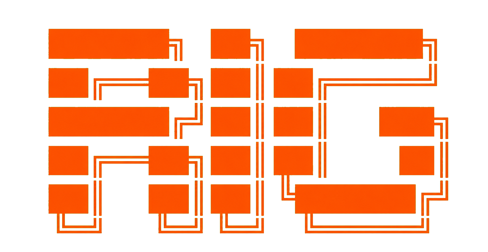

<div align="center">

<p></p>

<h3>The best of Pi, Codex, Claude Code, and Grok Build — unified in one coding-agent harness.</h3>

<p>
  Use model-native prompts and tools with provider access already configured on
  your machine. Rig adds no account or subscription of its own, never pools or
  resells provider access, and leaves provider terms and limits in force. 
  
  Built by the authors of
  <a href="https://github.com/slopus/happy">Happy</a> and
  <a href="https://github.com/slopus/happy2">Happy 2</a>.
</p>

https://github.com/user-attachments/assets/99a7dee6-36ef-4110-95b2-e236633640a4

<p>
  <a href="#quick-start">Quick start</a> ·
  <a href="#why-rig">Why Rig?</a> ·
  <a href="#how-rig-compares">Compare</a> ·
  <a href="#configuration">Configuration</a> ·
  <a href="DEVELOPMENT.md">Development</a>
</p>

</div>

Rig is an open-source coding-agent harness built on top of
[Pi](https://github.com/earendil-works/pi)'s foundations. It recreates the best
parts of [Codex](https://github.com/openai/codex),
[Claude Code](https://code.claude.com/docs/en/overview), and
[Grok Build](https://github.com/xai-org/grok-build) in one consistent local
runtime: the right prompts and tools for each model, useful defaults, safe
execution, durable sessions, subagents, MCP, and a friendly terminal interface.

The result is one harness that works well on its own and exposes a stable layer
for future client integrations. Apps can integrate once instead of maintaining
a different adapter for every coding agent.

## Quick start

### Step 1: Install Rig

```sh
npm install -g @slopus/rig
```

### Step 2: Sign in to the agents you want to use

Rig does not have another account to create. Run the coding agents you want and
complete their normal sign-in:

```sh
codex
claude
grok login
```

Rig then uses the credentials already managed by those installations. Grok
Build credentials are hot-reloaded from `~/.grok/auth.json`, so a later
`grok login` is picked up without copying tokens into Rig.

### Step 3: Start building

```sh
cd your-project
rig
```

Ask for what you want in plain English. Rig can inspect the repository, edit
files, run commands, delegate work, and verify the result. Use `/model` at any
time to choose an available model.

## Why Rig?

Pi is a wonderfully small, flexible foundation. Codex, Claude Code, and Grok
Build each add excellent model-specific behavior, but they expose different
tools, permissions, session models, and integration protocols. Rig brings those ideas together
without making you rebuild the setup for every model, machine, or repository.

- **Feels native to the model.** GPT receives Codex-style prompts and tools;
  Claude receives Claude Code-style prompts and tools; Grok receives the
  open-source Grok Build prompt and tool contracts.
- **One dependable workflow.** Sessions, permissions, MCP, Docker, background
  commands, reviews, goals, and headless execution work through one interface.
- **Thoughtful defaults.** A fresh install is useful immediately, while global
  and project-local configuration remain available when you need them.
- **Ready for other clients.** A local daemon, persisted sessions, and a durable
  event stream let terminal, mobile, and web clients build on the same runtime.
- **Open and local.** Rig is MIT licensed, runs beside your code, and keeps its
  execution boundaries visible.

And the name? We asked GPT-5.6 Sol for something short and easy to type on a
keyboard. It suggested **Rig**.

## How it works

Rig separates inference transport from agent behavior. That lets it share one
runtime without flattening the important differences between models.

| Path              | What Rig uses                                                                                                    | What Rig controls                                                                                                       |
| ----------------- | ---------------------------------------------------------------------------------------------------------------- | ----------------------------------------------------------------------------------------------------------------------- |
| Pi foundation     | Pi's inference adapters and terminal UI library                                                                  | The shared terminal, permissions, sessions, processes, persistence, and client protocol                                 |
| Codex             | Pi's Codex transport, with [OpenAI's source](https://github.com/openai/codex) as the behavioral reference        | Reimplemented Codex prompts, tool contracts, reasoning controls, collaboration, approvals, review, and transcript rules |
| Claude Code       | Anthropic's official [Claude Agent SDK](https://code.claude.com/docs/en/agent-sdk/overview) for direct inference | Reimplemented Claude-facing prompts, tools, tasks, subagents, permissions, and session behavior                         |
| Grok Build        | xAI's OpenAI-compatible Responses API and the credentials managed by the Grok CLI                                | Adapted [Grok Build](https://github.com/xai-org/grok-build) prompt, tools, token refresh, and request metadata          |
| Other model paths | Pi inference adapters and selected generic Pi tool definitions                                                   | A useful fallback experience without pretending those models are Codex or Claude Code                                   |
| External clients  | Rig's local daemon, durable event stream, and protocol                                                           | One stable API for terminal, headless, mobile, web, or other interfaces                                                 |

The Codex integration is implemented inside Rig rather than wrapping the Codex
CLI. Rig follows the open-source client closely so prompts, tools, permissions,
and interaction patterns behave as Codex models expect while still participating
in Rig's shared runtime.

Claude takes a different route. Rig calls the official Claude Agent SDK directly
for inference, but disables its built-in tools, skills, slash commands, and
filesystem settings. Rig then supplies its own implementations of those surfaces.
This keeps Claude's native inference path while giving Rig one place to control
tools, permissions, persistence, subagents, and client events.

Grok Build uses xAI's Responses API at the same first-party proxy as the
open-source CLI. Rig reads Grok's scoped auth store on every request, prefers an
active interactive session over `XAI_API_KEY`, proactively refreshes expiring
OIDC credentials, persists rotated refresh tokens, and sends Grok's native
request identity headers. At daemon startup it fetches the authenticated
account's model catalog, falling back to Grok's local model cache and the
built-in `grok-build` route when discovery is unavailable. Selectable reasoning
efforts are exposed only when the catalog advertises them; `grok-build` keeps
its always-on reasoning behavior, while models without effort support receive
no effort override. A failed inference request is not replayed.

That separation is what makes Rig flexible: transports can stay provider-native
while the surrounding harness remains consistent and independently evolvable.
Anthropic's [current Claude plan policy](https://support.claude.com/en/articles/15036540-use-the-claude-agent-sdk-with-your-claude-plan)
explicitly includes third-party apps authenticated through the Agent SDK: their
usage continues to draw from the user's subscription limits. Rig follows that
local SDK path. It does not host a Claude login, relay credentials through a Rig
service, pool access, or bypass Anthropic's terms and limits.

## How Rig compares

Rig is a unifying harness, not a replacement for every surface offered by Pi,
Codex, or Claude Code. This table focuses on the local coding-agent experience.

|                        | Rig                                                                   | [Pi](https://github.com/earendil-works/pi)                   | [Codex](https://github.com/openai/codex)  | [Claude Code](https://code.claude.com/docs/en/overview) |
| ---------------------- | --------------------------------------------------------------------- | ------------------------------------------------------------ | ----------------------------------------- | ------------------------------------------------------- |
| Primary role           | Opinionated multi-model harness                                       | Minimal, highly extensible agent toolkit                     | OpenAI's native coding agent              | Anthropic's native coding agent                         |
| Model access           | Codex, Claude Code, Grok Build, and optional Bedrock models           | Broad multi-provider catalog                                 | OpenAI models                             | Claude models, including supported cloud platforms      |
| Authentication         | Reuses Codex, Claude Code, and Grok credentials                       | Pi logins or provider API keys                               | ChatGPT sign-in or API key                | Claude sign-in, API, or supported cloud provider        |
| Tool behavior          | Switches between model-native Codex, Claude, and Grok toolsets        | Small generic core, replaceable with extensions              | Codex-native                              | Claude Code-native                                      |
| Subagents              | Built in, with provider-aligned controls and saved transcripts        | Intentionally extension-driven                               | Built-in multi-agent tools                | Built-in subagents and agent teams                      |
| Permissions            | Unified Auto, Workspace write, Read only, and Full access modes       | Intentionally extension- or container-driven                 | Native approvals and sandboxing           | Native permission modes                                 |
| MCP                    | Built-in stdio, streamable HTTP, and legacy SSE support               | Available through extensions                                 | Built in                                  | Built in                                                |
| Long-running work      | Managed shells, workflows, persistent goals, and background subagents | Intentionally uses external tools such as tmux or extensions | Background commands and multi-agent work  | Background commands, tasks, and agents                  |
| Headless and embedding | Text, JSON, streaming JSON, daemon protocol, and durable events       | Print, JSON, RPC, and a TypeScript SDK                       | Non-interactive mode, SDK, and app server | Print mode and Agent SDK                                |
| Best fit               | One local harness across model families and client apps               | Building a deeply customized agent                           | The first-party OpenAI experience         | The first-party Anthropic experience                    |

Rig deliberately keeps Pi's strong foundations and extensibility, then chooses a
cohesive built-in experience where Pi prefers a minimal core. From Codex and
Claude Code it adopts widely useful workflows, not every product-specific edge
case.

## Everyday commands

Type `/` in the terminal to see the commands available in the current session.

| Command        | What it does                                           |
| -------------- | ------------------------------------------------------ |
| `/model`       | Choose the model and reasoning level                   |
| `/permissions` | Choose filesystem, shell, and network access           |
| `/agents`      | See delegated work and open a child transcript         |
| `/tasks`       | See the current Claude-style task list                 |
| `/goal`        | Start or manage a persistent long-running goal         |
| `/review`      | Review staged, unstaged, and untracked changes         |
| `/mcp`         | Check MCP servers, capabilities, and connection errors |
| `/workflows`   | Open the live workflow monitor                         |
| `/ps`          | List managed background terminals                      |
| `/compact`     | Summarize older messages and free context space        |
| `/usage`       | Show provider-reported token usage                     |
| `/configure`   | Change app settings                                    |

Press Escape while the session is idle to rewind to an earlier message. Rig puts
that prompt back in the composer without changing files in the working directory.

## Sessions and automation

### Headless execution

Use `rig exec` when you want an agent result without opening the terminal UI:

```sh
rig exec "Review the current changes"
printf 'Run the tests and fix failures' | rig exec
```

Use `--json` for one machine-readable result or `--stream-json` for newline-
delimited session events followed by the final result:

```sh
rig exec --json "Summarize this repository"
rig exec --stream-json "Run the test suite"
```

Add `--debug` to an interactive or headless invocation to capture every request
as ordered JSON files under `.rig/debug` in the project. Each request gets a
time-sortable directory containing normalized inference inputs, every streamed
provider event and final response, agent events and messages, tool arguments and
results, and run completion or failure details:

```sh
rig --debug
rig exec --debug "Diagnose the failing test"
```

The debug directory contains its own Git ignore rule. Its files use private
permissions, but can still contain complete prompts, source excerpts, command
output, and model reasoning; treat them as sensitive when sharing.

Headless runs are normal persisted sessions. Continue or branch from them later:

```sh
rig exec --last "Continue with the next issue"
rig exec --resume SESSION_ID "Try the alternative approach"
rig exec --last --fork "Explore a separate solution"
```

### Saved sessions

Use the picker to resume or fork work in the current directory. Add `--all` to
include sessions from other directories.

```sh
rig resume
rig resume --last
rig resume --all
rig fork --last
rig fork SESSION_ID
```

The model and provider can be changed between responses. Automatic compaction
keeps long conversations useful, and `/compact` is available whenever you want
to compact immediately.

### Persistent goals and code review

`/goal <objective>` starts work that can continue across multiple agent turns.
Use `/goal` to check it, `/goal pause`, `/goal resume`, or `/goal clear` to manage
it. Goals survive daemon restarts and resumed sessions.

`/review` performs a read-only review of staged, unstaged, and untracked changes.
Add a focus when useful, for example `/review focus on concurrency`.

## Permissions

New sessions start in **Workspace write** mode. Change the current session with
`/permissions`:

| Mode                | Behavior                                                                                                   |
| ------------------- | ---------------------------------------------------------------------------------------------------------- |
| **Auto**            | Runs routine workspace work immediately and reviews risky actions automatically, asking when needed        |
| **Workspace write** | Allows edits in the working directory while blocking shell network access and writes outside the workspace |
| **Read only**       | Keeps project files read only while allowing temporary shell output                                        |
| **Full access**     | Allows unrestricted filesystem, shell, and network access                                                  |

Auto mode evaluates the current action against the user's request. It does not
build a permanent command allowlist. Sensitive escalation requests receive a
one-call review and fail closed when the review is unavailable or malformed.

Set the default globally or for a repository:

```toml
[defaults]
permission_mode = "workspace_write"
```

`RIG_PERMISSION_MODE` can override the default for a new terminal session with
`auto`, `workspace_write`, `read_only`, or `full_access`.

## Configuration

Rig reads user-wide settings from `~/.config/rig/config.toml` and repository
settings from `rig.toml`. Repository values win where both are allowed. It also
understands Codex MCP entries from `~/.codex/config.toml` and `.codex/config.toml`.

A small project configuration might look like this:

```toml
[defaults]
permission_mode = "workspace_write"

[features]
workflows = true

[theme]
brand = "ansi:202"
accent = "cyan"
```

Provider availability is machine-wide because the local daemon owns the model
catalog and authentication paths. Configure it in `~/.config/rig/config.toml`:

```toml
[providers.codex]
enabled = true

[providers.claude]
enabled = true

[providers.grok]
enabled = true

[providers.bedrock]
enabled = true
```

These four built-in instances use the normal Codex, Claude Code, Grok, and Bedrock
credential locations, so their `type` is inferred. Disabling Codex or Claude
Code removes that provider and its native authentication path from the model
picker.

Add any number of named instances when you need separate accounts. For custom
instances, the section suffix is the provider ID shown in the model picker and
accepted by `defaults.provider` and `RIG_PROVIDER`. Custom instances must set
`type`; all parameters stay flat in the same section. The built-in Claude Code
instance retains `claude-sdk` as its provider ID for compatibility:

```toml
[providers.work_codex]
type = "codex"
auth_file = "/Users/me/.codex-work/auth.json"
transport = "auto"
include_models = ["openai/gpt-5.6-sol", "openai/gpt-5.6-terra"]

[providers.personal_claude]
type = "claude"
config_dir = "/Users/me/.claude-personal"
exclude_models = ["anthropic/haiku-4-5"]

[providers.work_grok]
type = "grok"
auth_file = "/Users/me/.grok-work/auth.json"
include_models = ["xai/grok-build"]

[providers.west_bedrock]
type = "bedrock"
region = "us-west-2"
bearer_token_env_var = "WEST_BEDROCK_TOKEN"

[providers.west_bedrock.model_overrides]
"openai/gpt-5.6-sol" = { region = "us-east-1", endpoint = "https://bedrock-mantle.example/openai/v1" }
"anthropic/opus-4-8" = { endpoint = "https://bedrock-runtime.example" }
```

Every provider accepts `enabled`, `include_models`, and `exclude_models`.
Filters use exact Rig model IDs; exclusions win when a model appears in both
lists. Codex instances also accept `auth_file`, `base_url`, and `transport`.
Claude Code instances accept `config_dir` and `executable`. Grok instances
accept `auth_file` and `base_url`; `RIG_GROK_BASE_URL` is also available for
local proxy testing. Bedrock instances
accept `region`, `model_overrides`, and `bearer_token_env_var`. `region` is the
provider default. Each exact Rig model ID under `model_overrides` may set
`region`, `endpoint`, or both. A full `endpoint` URL overrides the Mantle or
Bedrock Runtime endpoint selected for that model and bypasses Rig's regional
availability list. The resolved region is still used for regional
inference-profile IDs and request metadata. Restart the local daemon after
changing providers. Repository `rig.toml` files cannot change these
machine-level choices or credential paths.

Use `/configure` for common settings. Environment variables such as `RIG_MODEL`,
`RIG_PROVIDER`, `RIG_EFFORT`, and `RIG_PERMISSION_MODE` override the corresponding
default for a newly created session.

<details>
<summary><strong>Docker-backed sessions</strong></summary>

Connect Rig to a running container:

```sh
rig --docker-container my-development-container --docker-workdir /workspace
```

Or create a session container from an image already present in Docker:

```sh
rig --docker-image my-project-dev:local \
  --docker-workdir /workspace \
  --docker-env NODE_ENV=development \
  --docker-mount .:/workspace
```

The same options work with `rig exec`. `--docker-socket`, `--docker-name`, and
repeated `--docker-env` or `--docker-mount` options provide additional control.
Use `--local` to ignore a configured Docker default for one new session.

Machine-wide Docker defaults belong in `~/.config/rig/config.toml`:

```toml
[docker]
image = "my-project-dev:local"
workdir = "/workspace"
env = { NODE_ENV = "development" }
mounts = [
  { source = ".", target = "/workspace" },
  { source = "/Users/me/.cache/my-project", target = "/cache", read_only = true },
]
```

Relative mount sources resolve from the host directory where Rig starts. Use
absolute paths for home-directory mounts; `~` is not expanded. Repository
`rig.toml` files cannot select Docker images, sockets, environment variables, or
host mounts.

Image-backed containers are created on the first message and keep a stable,
session-derived name so their files survive daemon restarts. Rig never pulls an
image implicitly and leaves managed containers in place for you to remove with
Docker. Images and connected containers need `/bin/sh`, `readlink`, and common
POSIX file utilities.

</details>

<details>
<summary><strong>MCP servers</strong></summary>

Rig supports local stdio servers, streamable HTTP, and legacy SSE:

```toml
[mcp_servers.docs]
command = "docs-mcp-server"
args = ["--stdio"]
tool_timeout_sec = 30

[mcp_servers.issues]
url = "https://example.com/mcp"
bearer_token_env_var = "ISSUES_MCP_TOKEN"

[mcp_servers.legacy]
url = "https://example.com/sse"
transport = "sse"
```

MCP tools, resources, resource templates, prompts, pagination, form elicitation,
bearer tokens, and OAuth client credentials are supported. Live tool discovery
lets a session use tools added after startup. OAuth is available for streamable
HTTP, but not legacy SSE.

Only configure servers you trust. Stdio servers run as local processes, receive
the daemon environment, and are not restricted by the session filesystem
sandbox.

</details>

<details>
<summary><strong>Grok Build</strong></summary>

Install and sign in through the first-party Grok CLI, then choose Grok Build:

```sh
grok login
export RIG_PROVIDER="grok"
export RIG_MODEL="xai/grok-build"
rig
```

By default Rig reads `$GROK_HOME/auth.json`, or `~/.grok/auth.json` when
`GROK_HOME` is unset. It follows Grok's scoped auth format, skips deprecated
web-login tokens, refreshes OIDC sessions five minutes before expiry, and
atomically writes refreshed access and refresh tokens back to the same file.
An explicit API key or `XAI_API_KEY` can also authenticate the provider, subject
to xAI's model availability for that credential.

The built-in endpoint is `https://cli-chat-proxy.grok.com/v1`. Grok Build uses
the OpenAI-compatible `/responses` API with its upstream 500,000-token context,
sampling defaults, encrypted reasoning continuation, and `x-grok-*` request
headers. Rig adapts Grok's open-source prompt and primary tool definitions to
its shared execution and permission layer; it does not reproduce Grok's TUI,
schedulers, or dedicated Plan mode.

</details>

<details>
<summary><strong>Amazon Bedrock</strong></summary>

Bedrock becomes available when the daemon starts with an
`AWS_BEARER_TOKEN_BEDROCK` value:

```sh
export AWS_BEARER_TOKEN_BEDROCK="your Bedrock API key"
export AWS_REGION="us-east-1"
export RIG_PROVIDER="bedrock"
rig
```

To use Bedrock exclusively, disable the native authentication paths in the
machine-wide config and select a Bedrock default:

```toml
[defaults]
provider = "bedrock"
model = "openai/gpt-5.6-sol"

[providers.codex]
enabled = false

[providers.claude]
enabled = false

[providers.grok]
enabled = false

[providers.bedrock]
enabled = true
```

Rig uses `AWS_REGION`, then `AWS_DEFAULT_REGION`, and otherwise defaults to
`us-east-1`. Restart an already-running daemon after changing these variables.
The available model list follows AWS regional availability. GPT-5.6 Sol, Terra,
and Luna use Amazon Bedrock's Responses API and its 272,000-token context limit.
Sol is available in `us-east-1` and `us-east-2`; Terra and Luna are also
available in `us-west-2`. See the current
[OpenAI Bedrock guide](https://developers.openai.com/api/docs/guides/amazon-bedrock)
and [AWS launch announcement](https://aws.amazon.com/about-aws/whats-new/2026/07/openai-gpt-sol-terra/).

</details>

<details>
<summary><strong>Theme and display</strong></summary>

Rig follows Codex-style terminal color semantics by default. Override individual
roles globally or per repository:

```toml
[theme]
primary = "default"
secondary = "dim"
accent = "cyan"
brand = "ansi:202"
success = "green"
warning = "yellow"
error = "red"
```

Roles accept `default`, `dim`, ANSI names such as `bright_cyan`, palette indexes
such as `ansi:202`, or true-color values such as `#D97706`. `/fast` toggles the
Codex fast service tier when the selected provider supports it; fast inference
uses twice the plan usage.

</details>

<details>
<summary><strong>Workflows and app event synchronization</strong></summary>

Workflows are on by default. Disable them globally or per repository:

```toml
[features]
workflows = false
```

For client integrations, the daemon can keep an opt-in durable queue of session
and subagent lifecycle events:

```toml
[settings]
durable_global_event_queue = true
```

This setting is user-wide only. Authenticated daemon clients can read event
batches from `GET /events`, follow `GET /events/stream`, and acknowledge entries
with `POST /events/trim`. See the [event reference](EVENTS.md) for payloads and
queue behavior.

</details>

## Scope

Rig aims for the best common coding-agent workflows, not exhaustive parity with
every upstream option. It intentionally keeps planning in the normal agent flow,
uses standard terminal editing instead of modal editing, follows Codex skill
semantics, and relies on the existing Codex, Claude Code, and Grok login flows.

Rig also draws a clear boundary around the terminal UI. The terminal is for a
focused, linear agent workflow. Features that need a richer interaction model—
such as drag-and-drop, multiple independently scrolling panes, or complex visual
workspaces—belong in a dedicated UI built on Rig's durable API. Rig provides the
harness; it does not squeeze desktop-app interactions into a terminal.

It does not add a separate Plan mode, Vim mode, notebook editor, durable command
allow/deny history, dedicated IDE integration, or a separate Rig account. These
boundaries keep the harness understandable and the defaults strong.

## Development and contributing

Want to work on Rig itself? See [DEVELOPMENT.md](DEVELOPMENT.md) for repository
setup, tests, architecture notes, and the release process.

## License

Rig is available under the [MIT License](LICENSE). Adapted Grok Build portions
remain under Apache-2.0; see the [third-party notices](THIRD-PARTY-NOTICES.md).
